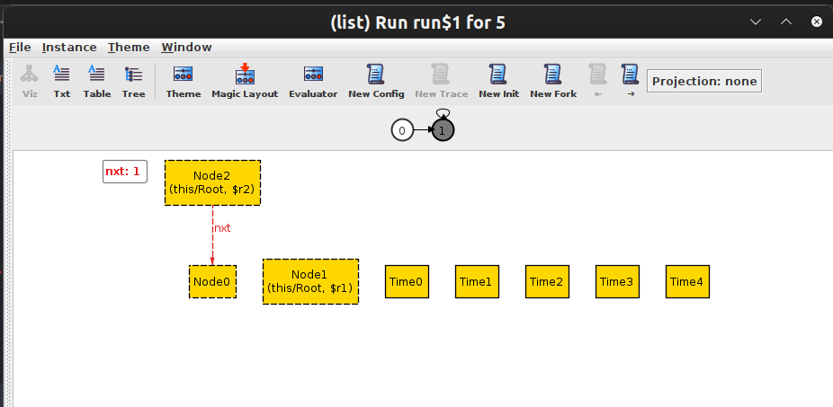
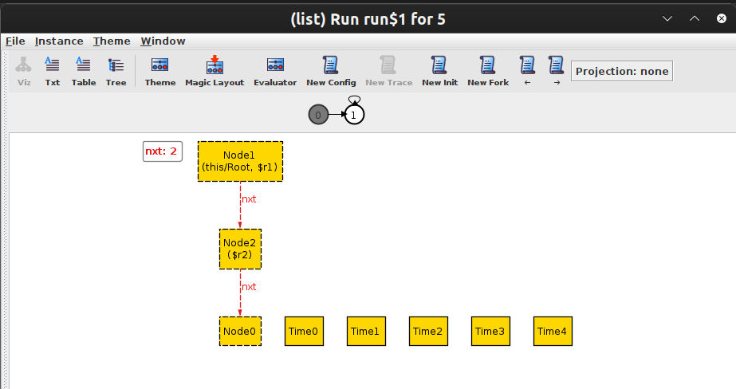

# List - model

Model of a static singly linked list on Alloy with the operation of joining two lists with time reference.

# [Alloy quick guide](https://alloytools.org/quickguide/)

## Some screenshots from Alloy Analyzer

